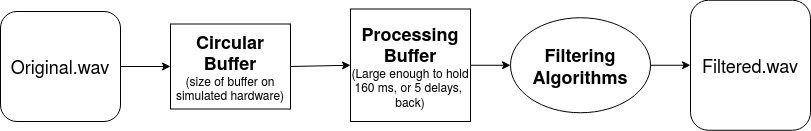
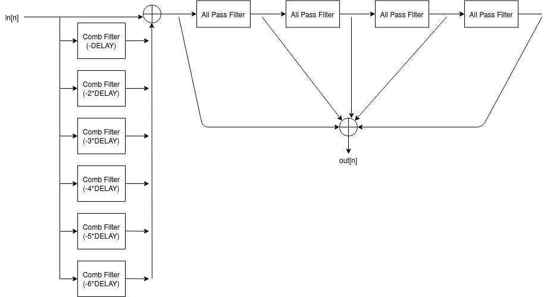

# DSP Implementation of Reverb - Project Update

## Team Members
**Mark Goldwater** and **Nathaniel Tan**

## Goals
Our lower bound goal is to record or source audio samples of a guitar and apply post-processing effects as if it were a real-time signal. We would  like to implement a reverb (echo) effect as well as one other depending on how much time we have left in the project.

If this goes well, our stretch goal is to utilize a [Feather M4 board](https://www.adafruit.com/product/3857) to apply our DSP in real time. This should be a port of the DSP process we used in our lower bound goal, but with different libraries that are relevant to the hardware.

## Learning Goals

### C DSP Libraries
Our learning goals for this project is to learn about and experience low-level signal processing with C and learn how to use various C libraries that are used for DSP. Both of us have had experience doing DSP in MATLAB, and would like some experience writing DSP algorithms in C and potentially connect our algorithms to hardware using the [Feather M4 board](https://www.adafruit.com/product/3857) if time allows. By the end of the project, we intend to achieve at least the development of one guitar effect which will be applied to a prerecorded signal.

### Real-Time DSP
In addition, we would like to gain experience with real-time signal processing which is why we want to handle the prerecorded signal as if it were real-time. This will allow for an easy transition between a pre-recorded signal and the hardware if we decide to achieve our stretch goal.

## Getting Started

### Software Arcitecture

We decided that a good way to start the project would be to write code that would take in a .wav file and then write the contents of that .wav file, unedited, to a new one. This would act as a stepping stone to ensure that we are able to reliably process the sound file type that we want to be able to add effects to. In order to do this, we utilized a [tutorial on truelogic.org](http://truelogic.org/wordpress/2015/09/04/parsing-a-wav-file-in-c/) in order to parse the header data from the wave file and then implemented the reading of the actual audio data ourselves.

Moreover, in order to simulate receiving samples from an actual piece of hardware we load samples into a circular buffer from the wave file. Note that this is not completely necessary for our post-processing software implementation, but we are including it in order to simulate hardware. In an actual hardware implementation, the circular buffer has the useful feature of overwriting old data when the buffer fills in order to ensure that the processing algorithms are receiving are the most recent. Then, we move samples from the circular buffer into a processing buffer, one-at-a-time, which is large enough to reach back 5 samples at appropriate delays for our filtering algorithm (architecture below). A rough architecture for our software flow of our audio samples can be seen below.

We have also narrowed down the effect we want to produce to Schroeder reverb and have found difference equations for this reverb architecture and constructed a block diagram which is shown in the next section.

### DSP Architecture

One of the first things that we did in creating our software was a block diagram of out DSP architecture which would be used to add a reverb effect to the input signal. Our design is based on the reverb implementation that is detailed out in
the data sheet for the [TMS320C672x component](https://www.ti.com/lit/an/spraaa5/spraaa5.pdf) by Texas Instruments. Our block diagram can be seen below.

Essentially, our architecture utilizes parellel Comb Filters to take a given sample from the wav file and add it together with six delayed samples where DELAY is about 32 ms. This output is then put through four All Pass Filters in series which pass all frequencies equally in gain, but changes the phase relationships amoung the various frequencies. The spaces between the All Pass Filters are then tapped and these samples are added together to procuce a single output value. Below are the difference equations we use for each filter (*Note: FF is the feed fowared gain, and FB is the feedback gain*).

Comb Filter: **y[n] = FF * x[n] + FB * y[n-DELAY]**. \
All Pass Filter: **y[n] = - FF * x[n] + x[n-DELAY] + FB * y[n-DELAY]**.

### Current Resources

- [.Wav file parsing tutorial on truelogic.org](http://truelogic.org/wordpress/2015/09/04/parsing-a-wav-file-in-c/)
- [Circular buffer implementation](https://github.com/embeddedartistry/embedded-resources/tree/master/examples/c/circular_buffer)
- [Audio processing device data sheet from TI - has helpful block diagrams](https://www.ti.com/lit/an/spraaa5/spraaa5.pdf)
- [Shroeder reverberator paper - has a nice overview and difference equations](http://www.paulwittschen.com/files/schroeder_paper.pdf)

## Current Work

### Debugging Comb Filter
We have already written a comb filter for our data processing. A comb filter is a frequency domain transformation that has a series of evenly spaced notches in the frequency response, [which looks like a comb](https://en.wikipedia.org/wiki/Comb_filter). This is implemented in the time domain by adding delayed samples to the signal. The difference equation is as follows where FF is the feedforward gain and FB is the feedback gain:

**y[n] = FF * x[n] + FB * y[n-DELAY]**

This is a very simple difference equation to implement. We however, are running into a very curious problem. When our feedback gain is 1, the comb filter works as intended, and you can hear the delayed audio overlapped with the original audio. When the feedback gain is not 1 however, the output consists of very loud signal noise. We have not pinpointed the cause of the problem yet. Both Mark and Nathaniel are working on the task of debugging this problem. This task will be done when the noise is gone and our comb filter produces an appropriate delay in the audio. This is demonstrated by playing the output audio and hearing the appropriate delay effect without any noise.

### Implementing All-Pass Filter
An all pass filter is a filter which creates a phase offset in the signal. It is implemented by the following difference equation:

**y[n] = - FF * x[n] + x[n-DELAY] + FB * y[n-DELAY]**

Both Mark and Nathaniel are working on this task. This task is done when the all-pass filter is written and tested. This is demonstrated by linking it with our comb filter, producing the reverb effect we desire in the output audio. This will be evaluated by both team members through listening to the output audio.

### Refactoring Code
We want our code to easily read and modified. Our code is pretty well structured right now but things could still be refactored. Both Mark and Nathaniel are working on this task. The definition of done for this task is a lot more ambiguous than others, we will work on this until both team members agree that they are satisfied with the re-factor.

## Links: [GitHub](https://github.com/MarkG98/C-Verb), [Trello](https://trello.com/b/D3GjNhy6/c-verb)
